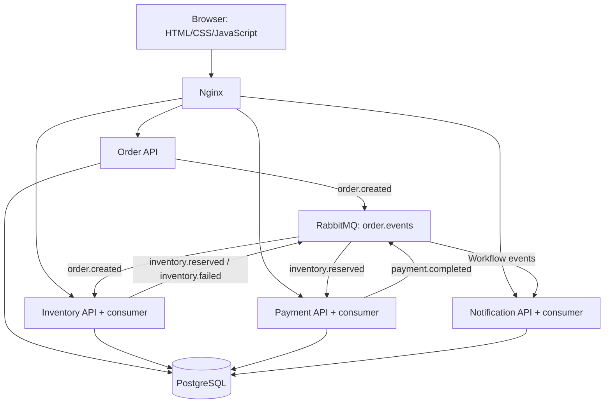

# Current architecture

```mermaid
flowchart TD
 B[Browser: HTML/CSS/JavaScript] --> N[Nginx]
 N --> O[Order API]
 N --> I[Inventory API + consumer]
 N --> P[Payment API + consumer]
 N --> Q[Notification API + consumer]
 O -->|order.created| R[RabbitMQ: order.events]
 R -->|order.created| I
 I -->|inventory.reserved / inventory.failed| R
 R -->|inventory.reserved| P
 P -->|payment.completed| R
 R -->|Workflow events| Q
 O --> D[(PostgreSQL)]
 I --> D
 P --> D
 Q --> D
```

Payment is simulated. Notification records events in the database. Azure services are future migration scope, not the local runtime.
